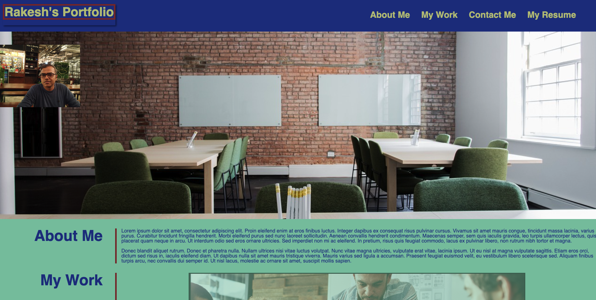

Advanced CSS Challenge: Professional Portfolio

I have written the HTML and CSS for a sample professional portfolio, which is still in progress and more projects will be added over time. I did some research on google and used the learning from first two weeks of bootcamp on HTMl and CSS. Also paid attention to the user stories and acceptance criteria.

There are three sections on the HTML page- About Me, My Work, and Contact Info.
I have included functioning navigation links at the top of the page to take the user to the respective sections
For the resume link I have pointed to my LinkedIn Profile page
I have included a recent photo of myself.
There is only one project in My Work section which the Module 1 challenge from week 1, rest of the My work section is a Placeholder at the moment. Going forward I will add more projects as I complete them
The non-placholder applications will take the user to my github page for that application
The page was styled for multiple screen sizes, including tablets and mobile phones.
I have also included some on hover effects for the various links and the projects on the page.

Link to the deployed application : https://rakeshprasad13.github.io/Rakesh_Portfolio/

Screenshot of My Protolio page :

